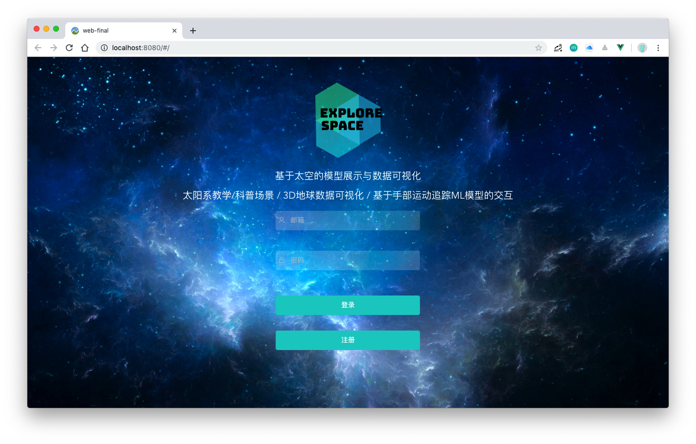
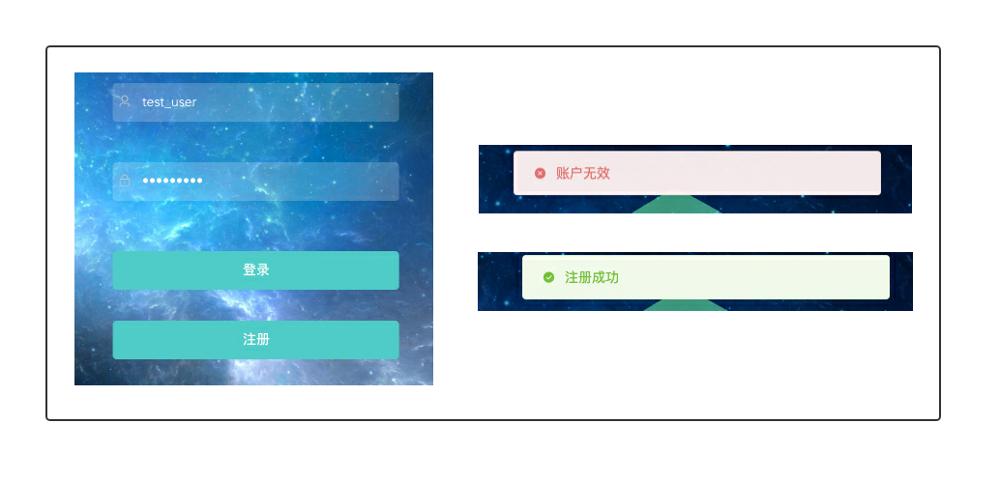
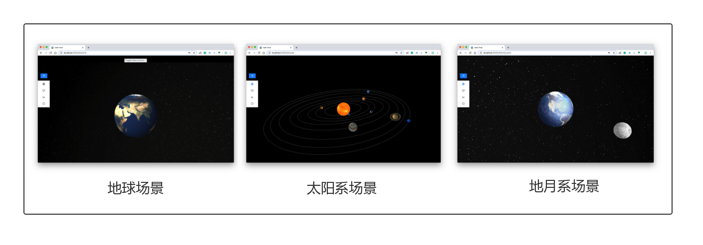
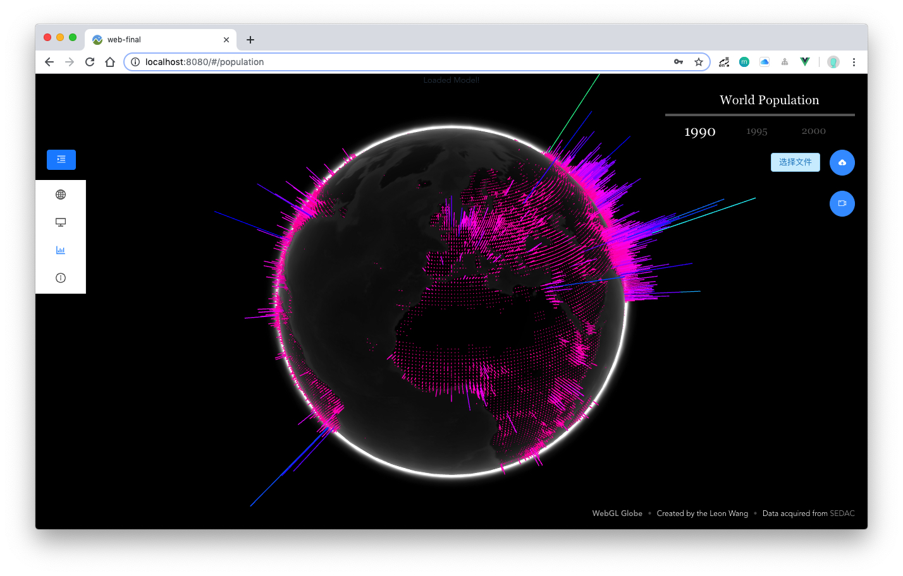
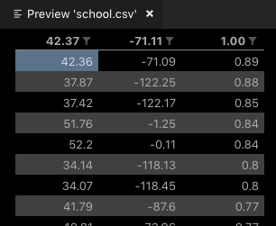
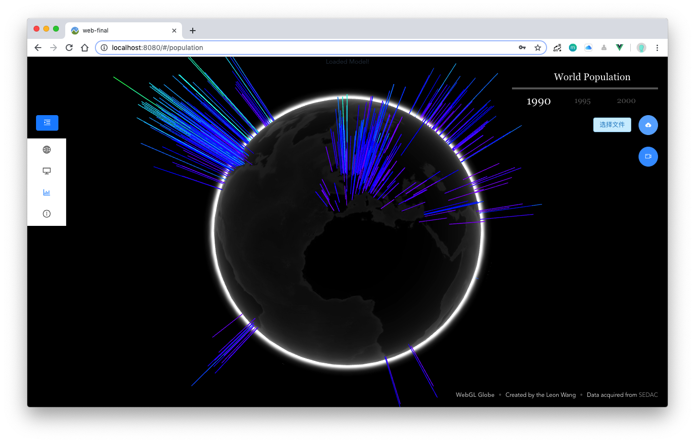

# Explore Space

> Web课程期末项目报告
>
> 1653340 王亮

[TOC]

## 1. 基本介绍

Explore Space 是一款以宇宙空间为主题，应用了Web 3D、前端机器学习等新颖 Web 技术，前后端功能完备的 Web 应用。

包括以下两大核心功能：

- 适用于**教学/科普**的模型展示场景
- 基于3D地球的**数据可视化**

## 2. 亮点/创新点

1. 基于 JWT 的用户认证
2. 基于 Three.js 实现的 Web 3D 场景
3. 基于 Tensorflow.js 实现的前端机器学习模型部署
4. 允许用户上传自定义数据进行可视化（上传文件/后端对文件进行操作）

## 3. 功能介绍

### 3.1 注册/登录

基于 JWT 技术进行用户认证，实现用户注册登录功能。

### 3.2 教学/科普场景展示

借助 Three.js ，基于 Web 3D 技术构建宇宙场景，目前可以展示的场景包括：

1. 地球场景
2. 地-月系统场景
3. 太阳系场景

其中，太阳系场景的场景较为复杂，因此以 **太阳系场景** 为例，进行介绍。

在此场景中，主要实现的功能有：

1. 设置不同星球的公转轨道和公转速度
2. 设置不同星球的自转轴偏转角度和自转速度
3. 鼠标悬停在星球上时，显示该星球名称的 3D 文本
4. 鼠标点击星球时，显示该星球相关的文本介绍

> 由于使用中文渲染3D文本时，需要在中文字体库中进行检索且中文字体库文件比英文字体库要大很多，导致使用中文渲染3D文本响应时间过长，性能表现很差，因此采用星球的英文名称进行3D文本渲染。

### 3.3 基于3D地球的数据可视化

基于3D地球模型进行数据可视化。该场景下除基本的交互操作外，还支持以下功能：

1. 基于手部目标检测与运动追踪的交互

    本项目在前端通过 `Tensorflow.js` 部署了机器学习模型进行手部识别，通过对手部目标的坐标计算追踪手部运动，进一步调整3D模型的方向，实现交互操作。

2. 上传自定义数据

    用户除可以浏览默认 "世界人口统计" 数据外，还可以上传自定义数据，数据文件格式要求必须为 **CSV** 格式文件，且符合以下格式（注意第一行开始就是数据，没有标题行）：

    | 每个数据点的x坐标 | 每个数据点的y坐标 | 每个数据点的值 |
    | ----------------- | ----------------- | -------------- |

    以 "世界大学统计" 数据文件为例，展示上传后的可视化结果：

    

    

## 4. 项目架构与技术栈

### 4.1 前端

- 框架：Vue.js

- 库：

    | 名称          | 描述         |
    | ------------- | ------------ |
    | Three.js      | 实现web 3D   |
    | Tween.js      | 补间动画     |
    | jQuery        | 简化js操作   |
    | Highcharts.js | 2D数据可视化 |
    | axios         | 与后端通信   |

### 4.2 后端

- 编程语言：Go
- web框架：echo
- 数据库：mongoDB

### 4.3 API设计	

| url     | method | description |
| ------- | ------ | ----------- |
| /signup | POST   | 注册        |
| /login  | POST   | 登录        |
| /data   | POST   | 上传CSV文件 |

